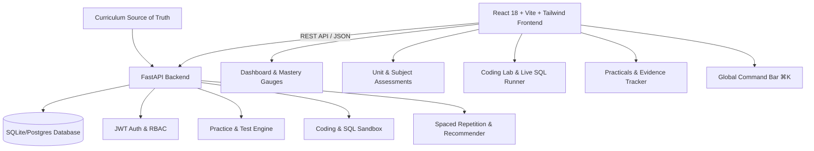

# Architecture & System Design — Semester OS

## 1. System Overview

**Semester OS** is a full-stack, personal study and mastery tracking platform designed specifically for the 3rd Semester B.Tech / BCA curriculum across exactly 5 subjects.

The system follows a strict 6-stage active learning loop:
`LEARN` → `PRACTICE` → `TEST` → `ANALYZE` → `REVISE` → `MASTER`

---

## 2. Technology Stack

### Frontend
- **Framework**: React 18 + Vite + TypeScript (Strict Type Safety)
- **Styling**: Tailwind CSS v3 with custom dark theme, subtle glowing brand accents (`#6366f1`), and glassmorphism.
- **State Management**: Zustand (with persistent localStorage token auth)
- **Visual Analytics**: Recharts (Stacked Bars, Donut Gauges, Trend lines)
- **Icons**: Lucide React
- **HTTP Client**: Axios with Bearer JWT interceptors and auto 401 redirection.

### Backend
- **Framework**: FastAPI (Python 3.11) with async routing
- **ORM**: SQLAlchemy 2.0 (AsyncSession + Greenlet)
- **Data Validation**: Pydantic v2
- **Database**: SQLite (via `aiosqlite`) for zero-configuration local dev; zero-effort migration to PostgreSQL via asyncpg.
- **Security**: Direct `bcrypt` password hashing with salt + JWT token generation (`python-jose`).
- **Sandbox**: In-memory SQLite runner for safe, isolated SQL query execution without touching application tables.

---

## 3. Four-Component Mastery Formula

Topic mastery is computed deterministically across 4 equal pillars (each 25%):

$$\text{Mastery \%} = \left( \text{Theory} \times 0.25 + \text{Practice} \times 0.25 + \text{Assessment} \times 0.25 + \text{Revision} \times 0.25 \right) \times 100$$

- **Theory (25%)**: Notes read, concept summary marked.
- **Practice (25%)**: Interactive questions or coding problems solved.
- **Assessment (25%)**: Best score achieved in Unit/Subject test.
- **Revision (25%)**: Spaced repetition review cycles completed.

---

## 4. Security & Safety

- **Scope Quarantine**: Strict curriculum seeder validation ensures non-enrolled subjects (`CAP138`, `PES209`) are completely rejected and absent from all queries.
- **SQL Execution Isolation**: Arbitrary SQL execution by users is conducted within an in-memory ephemeral SQLite connection with read/write sandbox boundaries.
- **Authentication**: JWT tokens stored with configurable expiration; password length clamped safely to prevent bcrypt overflow.
