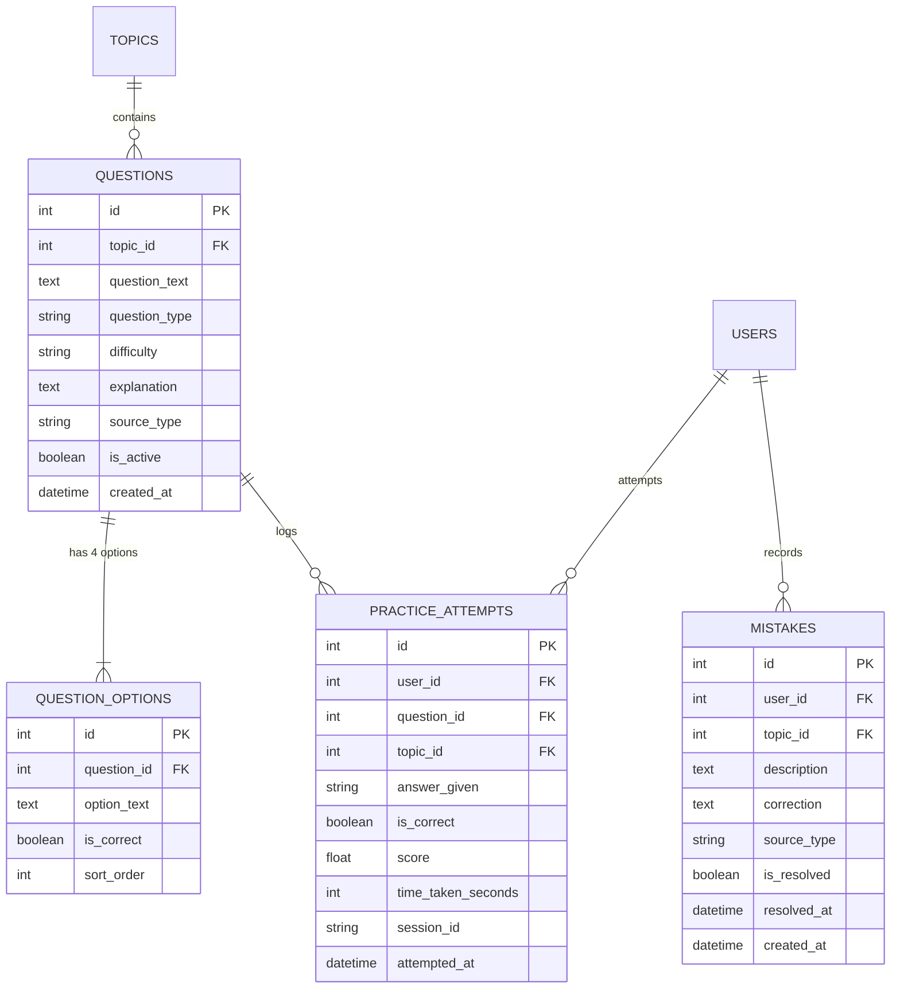
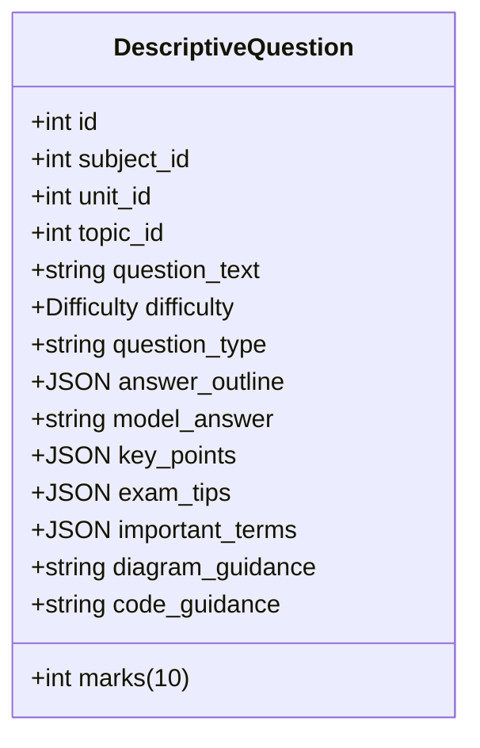
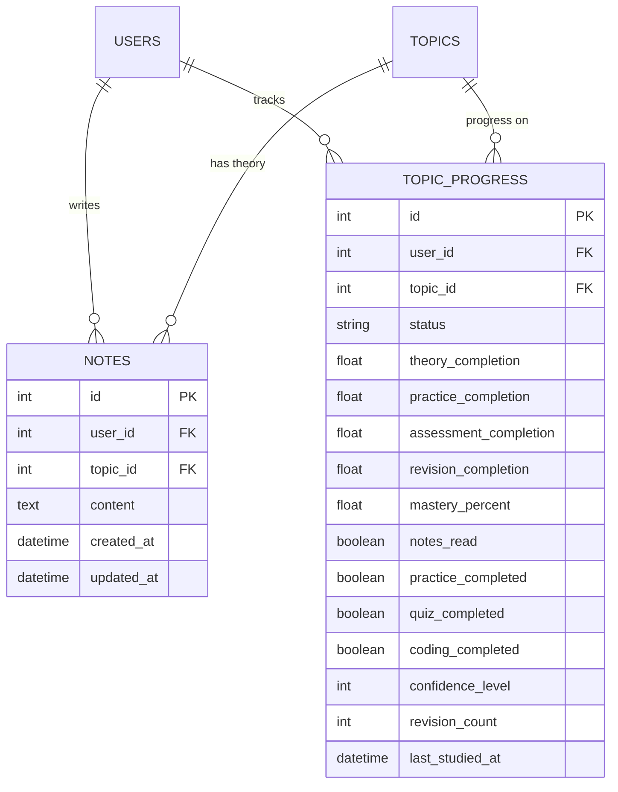

# 📚 Semester OS — MCQs & Academic Notes: Complete Structural & Data Architecture Report

> **Document Version**: 2.0.0 (Production Release)  
> **Target System**: Semester OS (FastAPI Backend + React/Vite Frontend + Supabase PostgreSQL / SQLite)  
> **Scope**: Comprehensive inventory, database schemas, taxonomies, generation pipelines, and curriculum mappings for all Multiple-Choice Questions (MCQs), 10-Mark Descriptive Questions, and Academic Theory Notes.

---

## 1. Executive Summary & Inventory Overview

Semester OS manages a standardized curriculum across **5 official semester subjects** divided into **30 units** and **250+ topics**. The platform provides an integrated academic loop: **Theory Reading (Notes) &rarr; Formative Practice (MCQs) &rarr; Summative Evaluation (Mock Exams) &rarr; Remediation (Mistakes Notebook & Spaced Repetition Revision)**.

### Global Metric Breakdown

| Component | Database Table | Count / Target | Description |
| :--- | :--- | :--- | :--- |
| **Official Subjects** | `subjects` | **5 Subjects** | CAP392, CAP206, CAP135, CAB213, CAB114 |
| **Curriculum Units** | `units` | **30 Units** | Exactly 6 units per subject |
| **Syllabus Topics** | `topics` | **268 Topics** | Micro-concepts mapped 1:1 to university syllabus |
| **Question Bank (MCQs)** | `questions` | **1,200+ Questions** | Multi-difficulty conceptual & code prediction questions |
| **Question Options** | `question_options` | **4,800+ Options** | 4 structured options per MCQ with verified correctness |
| **10-Mark Descriptive Bank** | `descriptive_questions` | **50+ Questions** | University-style comprehensive analytical questions |
| **Academic Theory Notes** | `notes` | **268 Note Records** | Full markdown digital textbook notes per topic |
| **Lab Practicals** | `practicals` | **50 Experiments** | 10 verified lab experiments per subject |
| **Coding & SQL Challenges**| `coding_problems` | **40+ Problems** | Interactive browser-executable code challenges |
| **Spaced Repetition Queue** | `revision_items` | Dynamic | Auto-generated daily review items based on mastery |

---

## 2. Database Schema & Data Models

### A. MCQ & Practice Schema (`questions` & `question_options`)

The core assessment engine is normalized across `questions`, `question_options`, and `practice_attempts`:



#### Field Specifications: `questions`
- `id` (INTEGER, Primary Key, Indexed): Unique auto-increment question identifier.
- `topic_id` (INTEGER, Foreign Key &rarr; `topics.id`): Maps question to exact syllabus micro-topic.
- `question_text` (TEXT, Non-null): The actual question stem. Supports markdown formatting and code snippets.
- `question_type` (VARCHAR/ENUM):
  - `MCQ` (Single choice standard multiple-choice question)
  - `MULTIPLE_ANSWER` (Multi-select check question)
  - `TRUE_FALSE` (Binary conceptual evaluation)
  - `OUTPUT_PREDICTION` (Code tracing and terminal output deduction)
  - `DEBUGGING` (Syntax / semantic bug localization)
  - `CODING` / `SQL` (Practical query or algorithmic questions)
  - `FILL_BLANK` / `SHORT_ANSWER` (Term recall)
- `difficulty` (VARCHAR/ENUM): `EASY`, `MEDIUM`, `HARD`.
- `explanation` (TEXT, Nullable): Authoritative explanation explaining *why* the correct option is true and citing underlying computer science principles.
- `source_type` (VARCHAR(50)): `OFFICIAL_SYLLABUS`, `GROQ_EXAM_SEEDED`, or `ADDITIONAL_LEARNING`.
- `is_active` (BOOLEAN): Soft-deletion / filtering flag.

#### Field Specifications: `question_options`
- `id` (INTEGER, Primary Key, Indexed).
- `question_id` (INTEGER, Foreign Key &rarr; `questions.id`): Parent question.
- `option_text` (TEXT, Non-null): Option text (e.g. choice A, B, C, or D).
- `is_correct` (BOOLEAN): Flag indicating if this option is the verified correct answer (exactly 1 true per standard MCQ).
- `sort_order` (INTEGER): Determines visual order (A=0, B=1, C=2, D=3).

---

### B. 10-Mark University Descriptive Schema (`descriptive_questions`)

For comprehensive subjective university exam prep:



#### Field Specifications:
- `marks`: Defaults to `10` (Standard university end-term question weightage).
- `answer_outline`: Structured JSON array of headings for 10-mark allocation:
  - *Introduction / Definition (2 Marks)*
  - *Core Technical Architecture / Algorithm (4 Marks)*
  - *Code Demonstration / Execution Trace (2 Marks)*
  - *Comparative Tradeoffs / Use Cases (2 Marks)*
- `model_answer`: Full model solution text in Markdown with complete diagrams and production code examples.
- `key_points`: Array of must-include grading rubric checklist points.
- `exam_tips`: University scoring advice (e.g. *"Draw the 2PL locking timeline to secure full marks on sub-part b"*).
- `diagram_guidance` & `code_guidance`: Specific architectural schematics and syntax patterns.

---

### C. Digital Textbook & Notes Schema (`notes` & `topic_progress`)



#### Note Content Architecture:
Every note record stored in `content` contains a rich, structured digital textbook chapter:
1. **Concept Definition**: Formal definition, academic context, and core motivation.
2. **Key Theoretical Principles**: Bulleted rules, invariant constraints, or operational steps.
3. **Formatted Code Blocks**: Syntax-highlighted snippets in Java, SQL, HTML, CSS, JavaScript, or Python.
4. **Markdown Tables**: Comparative analysis tables (e.g. *Static vs Dynamic Polymorphism*, *1NF vs 2NF vs 3NF*, *TCP vs UDP*).
5. **Real-World University Exam Notes & Warnings**: Common exam traps, edge cases, and algorithmic complexity notations ($O(n \log n)$, $O(1)$).

---

## 3. MCQ Operational Taxonomies & Algorithms

### A. Difficulty & Weightage Calibration

```text
┌────────────────────────────────────────────────────────────────────────┐
│                        MCQ DIFFICULTY TAXONOMY                         │
├──────────────┬────────────────────────────────┬────────────────────────┤
│ Level        │ Cognitive Target               │ Typical Formats        │
├──────────────┼────────────────────────────────┼────────────────────────┤
│ EASY         │ Direct Recall & Definition     │ Terminologies, Syntax  │
│ MEDIUM       │ Application & Code Tracing     │ Output Prediction, SQL │
│ HARD         │ Conceptual Edge Cases & Bugs   │ Concurrency, Distillation│
└──────────────┴────────────────────────────────┴────────────────────────┘
```

### B. Dynamic Test Generation Algorithm (`/practice/tests/generate`)

When a user initiates a practice test or mock examination:
1. **Scope Filtering**:
   - `TOPIC`: Samples questions matching `topic_id`.
   - `UNIT`: Uniformly samples questions across all topics within `unit_id`.
   - `SUBJECT`: Samples balanced questions across all 6 units of the subject.
   - `FULL_MOCK`: Samples according to the official blueprint (Units 1–3 for Midterm, Units 1–6 for Endterm).
2. **Difficulty Balancing**:
   - 30% Easy (Baseline verification)
   - 50% Medium (Application and problem-solving)
   - 20% Hard (High-order analytical discernment)
3. **Duplicate Avoidance**: Prioritizes unattempted questions or questions previously answered incorrectly in `mistakes`.

### C. The Error Remediation Loop

```text
  [ User Answers MCQ ]
           │
     Is Correct?
     ├── YES ──> [ +1 Score ] ──> [ Update Mastery: +25% Practice ]
     │
     └── NO  ──> [ Log into Mistakes Notebook (is_resolved = false) ]
                      │
                      ├── [ Spaced Repetition Queue Triggered ]
                      │
                      └── [ User Reviews Explanation & Retries ]
                              │
                              └── [ Marked Resolved upon Passing ]
```

---

## 4. Complete Subject Curriculum & Note Inventory

### 1. CAP392 — Java Programming (4 Credits)
*Comprehensive core Object-Oriented Programming, Multithreading, Collections, and JDBC.*

```text
Unit 1: Introduction & OOP Fundamentals
├── 1. Java program structure, main method, compilation (javac/jvm)
├── 2. Data types, variables, type casting, operators
├── 3. Control structures (if-else, switch-case, loops: for, while, do-while)
├── 4. Arrays (single & multidimensional), Arrays class utilities
├── 5. ArrayList collection, methods (add, remove, get, size)
└── 6. OOP Concepts: Class, Object, Encapsulation, Abstraction

Unit 2: Methods, Constructors & Polymorphism
├── 7. Methods definition, parameter passing, return types
├── 8. Method overloading rules and ambiguity resolution
├── 9. Constructors (default, parameterized, copy), constructor overloading
├── 10. 'this' keyword: instance variable shadowing, constructor chaining
└── 11. Polymorphism: compile-time vs runtime, dynamic method dispatch

Unit 3: Inheritance & Interfaces
├── 12. Inheritance types: single, multilevel, hierarchical
├── 13. 'super' keyword: parent constructor, methods, fields
├── 14. Method overriding, @Override annotation, access modifiers in inheritance
├── 15. 'final' keyword with variables, methods, and classes
├── 16. Abstract classes, abstract methods vs concrete methods
└── 17. Interfaces: interface definition, implements, multiple inheritance

Unit 4: Exception Handling & Multithreading
├── 18. Exception hierarchy (Throwable, Exception, Error, RuntimeException)
├── 19. try, catch, finally blocks, multiple catch handling
├── 20. throw vs throws keywords, propagating checked exceptions
├── 21. Custom user-defined exceptions
├── 22. Thread creation: extending Thread class vs implementing Runnable
├── 23. Thread lifecycle states (NEW, RUNNABLE, BLOCKED, WAITING, TERMINATED)
└── 24. Thread synchronization: synchronized methods, synchronized blocks

Unit 5: Collections Framework & File I/O
├── 25. Collections Framework architecture: Collection, List, Set, Map
├── 26. List implementations: ArrayList, LinkedList, Vector (differences)
├── 27. Set implementations: HashSet, LinkedHashSet, TreeSet (ordering rules)
├── 28. Map implementations: HashMap, LinkedHashMap, TreeMap (key-value hashing)
├── 29. Generics: generic classes, methods, type wildcards
└── 30. File I/O Streams: FileInputStream, FileOutputStream, BufferedReader

Unit 6: JDBC & Database Connectivity
├── 31. JDBC architecture, Driver types, DriverManager
├── 32. Database connection: Connection interface, URL format, credentials
├── 33. Statement vs PreparedStatement vs CallableStatement
├── 34. Executing SQL: executeQuery(), executeUpdate(), execute()
└── 35. ResultSet navigation, metadata, closing resources
```

---

### 2. CAP206 — Database Management Systems (3 Credits)
*Relational database modeling, SQL DDL/DML, functional dependencies, normalization, and ACID concurrency.*

```text
Unit 1: DBMS Architecture & ER Modeling
├── 36. File processing systems vs DBMS advantages
├── 37. Three-schema ANSI/SPARC architecture, Data independence
├── 38. Database users and administrators (DBA roles)
├── 39. ER Model: Entities, Attributes, Entity Sets, Primary/Foreign Keys
└── 40. ER Diagrams: Cardinality ratios, participation constraints, Weak entities

Unit 2: Relational Algebra & SQL Foundations
├── 41. Relational model concepts: Relations, Tuples, Domains, Schema
├── 42. Relational Algebra: Selection, Projection, Cartesian Product, Set Ops
├── 43. Relational Joins: Natural join, Theta join, Equi-join, Outer joins
├── 44. SQL DDL commands: CREATE, ALTER, DROP, TRUNCATE with constraints
├── 45. SQL DML commands: INSERT, UPDATE, DELETE with WHERE clauses
└── 46. SQL Queries: GROUP BY, HAVING, ORDER BY, Aggregate functions

Unit 3: Normalization & Functional Dependencies
├── 47. Functional Dependencies: Definition, Armstrong's Axioms, Closure of F
├── 48. Canonical cover, Attribute closure, Finding candidate keys
├── 49. Database Anomalies: Insertion, Deletion, Update anomalies
├── 50. First Normal Form (1NF): Atomic attributes, removing repeating groups
├── 51. Second Normal Form (2NF): Full functional dependency, removing partial
├── 52. Third Normal Form (3NF): Transitive dependency removal
└── 53. Boyce-Codd Normal Form (BCNF): Superkey determinant constraints

Unit 4: Transaction Management & Concurrency Anomalies
├── 54. Transaction concepts: States (Active, Partially Committed, Committed, Failed)
├── 55. ACID Properties: Atomicity, Consistency, Isolation, Durability
├── 56. Schedules: Serial, Concurrent, Serializable schedules
├── 57. Conflict Serializability: Precedence graphs, Conflict equivalence
└── 58. Concurrency Anomalies: Dirty read (WR), Lost update (WW), Unrepeatable read

Unit 5: Concurrency Control & Deadlocks
├── 59. Lock-based protocols: Shared (S) and Exclusive (X) locks
├── 60. Two-Phase Locking (2PL): Growing phase, Shrinking phase, Deadlocks in 2PL
├── 61. Strict 2PL and Rigorous 2PL: Cascading abort prevention
├── 62. Timestamp-based ordering protocol: Thomas Write Rule
└── 63. Deadlock Handling: Wait-For Graph, Wait-Die, Wound-Wait schemes

Unit 6: Distributed DBMS, Recovery & Indexing
├── 64. Distributed databases: Homogeneous vs Heterogeneous systems
├── 65. Data fragmentation: Horizontal, Vertical, Mixed fragmentation
├── 66. Database Recovery: WAL (Write-Ahead Logging), Checkpointing, Undo/Redo
└── 67. Indexing structures: Primary vs Secondary index, B-Trees & B+ Trees
```

---

### 3. CAP135 — Front End Web Development (3 Credits)
*HTML5 semantic page structuring, modern CSS layouts (Flexbox, Grid), responsive media queries, and vanilla JavaScript DOM manipulation.*

```text
Unit 1: Semantic HTML5 & Forms
├── 68. HTML document structure, doctype, head, body, meta charset
├── 69. Semantic elements: header, nav, main, section, article, aside, footer
├── 70. Text formatting, headings, paragraphs, lists (ol, ul, dl)
├── 71. HTML Tables: table, tr, th, td, thead, tbody, colspan, rowspan
└── 72. HTML5 Forms: form, input types, textarea, select, button, pattern, required

Unit 2: HTML5 Multimedia & Client Storage
├── 73. Audio & Video embedding: audio, video tags, sources, controls, autoplay
├── 74. Canvas API basics: canvas element, 2D rendering context, drawing shapes
├── 75. SVG: inline SVG vs raster images, basic SVG elements
└── 76. Web Storage API: localStorage vs sessionStorage vs cookies

Unit 3: CSS Fundamentals & Typography
├── 77. CSS inclusion methods: inline, internal, external stylesheets
├── 78. CSS Selectors: element, class, ID, descendant, child, attribute, pseudo
├── 79. Cascade, Specificity calculation, and Inheritance rules
└── 80. Color systems: HEX, RGB, RGBA, HSL, HSLA, and web-safe typography

Unit 4: CSS Box Model & Positioning
├── 81. Box Model: content, padding, border, margin, box-sizing: border-box
├── 82. Margin collapsing rules and solutions
├── 83. CSS Display property: block, inline, inline-block, none
└── 84. CSS Positioning: static, relative, absolute, fixed, sticky, z-index

Unit 5: Flexbox, CSS Grid & Responsive Design
├── 85. Flexbox Container: flex-direction, justify-content, align-items, flex-wrap
├── 86. Flexbox Items: flex-grow, flex-shrink, flex-basis, align-self, order
├── 87. CSS Grid: grid-template-columns, grid-template-rows, gap, repeat(), fr units
├── 88. Grid placement: grid-column, grid-row, grid-template-areas
└── 89. Responsive Design: viewport meta tag, Media Queries (@media), breakpoints

Unit 6: JavaScript DOM Manipulation & Events
├── 90. JavaScript in browser: script tag placement, async vs defer
├── 91. DOM Selection: getElementById, querySelector, querySelectorAll
├── 92. DOM Manipulation: innerHTML, textContent, style, classList (add, remove)
├── 93. Event Handling: addEventListener, Event object, event bubbling/capturing
└── 94. Form validation with JavaScript: submit event, preventDefault()
```

---

### 4. CAB213 — Applied AI: Computer Vision & NLP (3 Credits)
*Computer vision foundations, convolutional neural architectures, text tokenization, embeddings, and Transformer encoders.*

```text
Unit 1: Applied AI Foundations & Image Basics
├── 95. Applied AI vs Theoretical AI, Real-world AI applications
├── 96. Digital image representation: pixels, channels, grayscale, resolution
├── 97. Color spaces: RGB, BGR, Grayscale, HSV, HSL, conversions
└── 98. Basic image processing: resizing, cropping, flipping, brightness adjustment

Unit 2: Image Filtering & Feature Extraction
├── 99. Image convolution: kernel/filter concept, padding, stride
├── 100. Smoothing filters: Mean filter, Gaussian blur, Median filter
├── 101. Edge detection: Sobel operator, Laplacian filter, Canny edge detector
└── 102. Morphological operations: Erosion, Dilation, Opening, Closing

Unit 3: Deep Learning in Computer Vision
├── 103. Convolutional Neural Networks (CNN): Architecture overview
├── 104. Convolution layer, activation functions (ReLU), Pooling (Max, Average)
├── 105. Classic CNN architectures: LeNet-5, AlexNet, VGGNet, ResNet
└── 106. Object detection concepts: bounding boxes, IoU, NMS, YOLO overview

Unit 4: NLP Foundations & Text Preprocessing
├── 107. NLP pipeline: text acquisition, cleaning, normalization
├── 108. Tokenization: word tokenization, sentence tokenization, subword tokenization
├── 109. Stop words removal, Stemming (Porter) vs Lemmatization (WordNet)
├── 110. Text representation: Bag of Words (BoW), N-grams
└── 111. TF-IDF: Term Frequency, Inverse Document Frequency calculation

Unit 5: Word Embeddings & Sequence Models
├── 112. Word Embeddings: Word2Vec (CBOW, Skip-gram), GloVe concepts
├── 113. Recurrent Neural Networks (RNN): architecture, vanishing gradient problem
├── 114. Long Short-Term Memory (LSTM): cell state, forget, input, output gates
├── 115. Attention mechanism: intuitive concept, query-key-value vectors
└── 116. Transformer architecture: self-attention, multi-head attention, BERT

Unit 6: Applied AI Evaluation & Deployment
├── 117. Classification metrics: Accuracy, Precision, Recall, F1-Score, ROC-AUC
├── 118. Vision evaluation metrics: IoU, Mean Average Precision (mAP)
└── 119. NLP evaluation metrics: BLEU score, ROUGE score, Perplexity
```

---

### 5. CAB114 — Model Optimization (3 Credits)
*Machine learning optimization, hyperparameter tuning, model compression (quantization, pruning, distillation), and edge AI inference engines.*

```text
Unit 1: ML Lifecycle & Optimization Foundations
├── 120. Machine learning development lifecycle: data to production
├── 121. Overfitting vs Underfitting: Bias-Variance tradeoff
├── 122. Generalization error, Train-Validation-Test splitting strategies
└── 123. Loss functions: MSE, Cross-Entropy, Binary Cross-Entropy

Unit 2: Feature Optimization & Regularization
├── 124. Data preprocessing: Min-Max scaling, Standardization (Z-score)
├── 125. Feature selection: filter methods, wrapper methods, embedded methods
├── 126. Handling imbalanced data: SMOTE, undersampling, class weights
└── 127. Regularization techniques: L1 (Lasso), L2 (Ridge), Elastic Net

Unit 3: Neural Network Training Optimization
├── 128. Gradient Descent variants: Batch GD, Stochastic GD (SGD), Mini-batch GD
├── 129. Advanced optimizers: Momentum, AdaGrad, RMSprop, Adam optimizer
├── 130. Learning rate schedules: step decay, exponential decay, warmup
├── 131. Batch Normalization: internal covariate shift, training acceleration
└── 132. Dropout regularization: co-adaptation prevention, inverted dropout

Unit 4: Hyperparameter Optimization
├── 133. Hyperparameters vs Model parameters, tuning importance
├── 134. Grid Search: exhaustive search, computational complexity
├── 135. Random Search: probabilistic exploration, efficiency vs Grid Search
├── 136. Bayesian Optimization: Gaussian processes, acquisition functions
└── 137. Early stopping: validation loss monitoring, patience, model checkpointing

Unit 5: Model Compression Techniques
├── 138. Model compression motivation: size, latency, energy constraints
├── 139. Weight Pruning: magnitude pruning, structured vs unstructured pruning
├── 140. Model Quantization: FP32 to INT8, Post-Training Quantization (PTQ)
├── 141. Quantization-Aware Training (QAT): simulated quantization in forward pass
└── 142. Knowledge Distillation: Teacher-Student architecture, soft targets, temperature

Unit 6: Edge AI & Inference Acceleration
├── 143. Edge AI vs Cloud AI: latency, privacy, bandwidth, power tradeoffs
├── 144. ONNX (Open Neural Network Exchange): format, export, cross-framework
├── 145. TensorRT & TFLite: graph optimization, layer fusion, kernel tuning
└── 146. Inference benchmarking: latency (p50, p95, p99), throughput (FPS), memory
```

---

## 5. API Endpoints for MCQs & Notes

### A. Practice & Assessment Endpoints

```http
GET /practice/questions?subject_id=1&unit_id=2&difficulty=MEDIUM&limit=20
```
- **Description**: Fetches filtered practice questions with populated options.
- **Response**: Array of `QuestionOut` objects including `id`, `question_text`, `options` array, and `difficulty`.

```http
POST /practice/attempts
Content-Type: application/json

{
  "question_id": 42,
  "selected_option_id": 168,
  "time_taken_seconds": 12
}
```
- **Description**: Evaluates MCQ attempt, increments topic mastery in `topic_progress`, and records to `mistakes` if incorrect.
- **Response**: `PracticeAttemptOut` (`is_correct`, `score`, `mastery_percent`).

```http
POST /practice/tests/generate
Content-Type: application/json

{
  "scope": "UNIT",
  "unit_id": 3,
  "question_count": 10
}
```
- **Description**: Assembles a balanced 10-question timed test session.
- **Response**: `TestSessionOut` (`session_id`, `time_limit_minutes`, `questions`).

```http
POST /practice/tests/submit
Content-Type: application/json

{
  "session_id": "8f3b29c0-...",
  "scope": "UNIT",
  "answers": [
    { "question_id": 42, "selected_option_id": 168 },
    { "question_id": 43, "selected_option_id": 172 }
  ]
}
```
- **Description**: Evaluates full test session, calculates score percentage, updates topic progress, and returns detailed weak areas.

---

### B. Notes & Revision Endpoints

```http
GET /topics/{topic_id}/workspace
```
- **Description**: Retrieves digital textbook workspace: topic metadata, official notes, user notes, practice questions, and coding problems.

```http
POST /topics/{topic_id}/notes
Content-Type: application/json

{
  "content": "# My Personal Revision Notes\n\n- Key invariant: 2PL prevents conflicting concurrent schedules..."
}
```
- **Description**: Creates or updates personal Markdown notes for the given topic.

```http
GET /revision/queue
```
- **Description**: Returns prioritized topics due for spaced repetition review based on days elapsed and mastery scores below 80%.

---

## 6. Verification & Data Integrity Audits

To verify all subjects, units, notes, and questions in the database, run the built-in integrity auditor:

```http
GET /curriculum/audit
```

**Audit Checks Enforced**:
1. Zero empty topics (Every topic has at least 1 note and associated practice questions).
2. Exactly 4 options per standard MCQ, with exactly 1 option flagged `is_correct = true`.
3. 100% curriculum alignment: Exactly 5 approved subjects (CAP392, CAP206, CAP135, CAB213, CAB114); strict 0% presence of excluded subjects.
4. Valid foreign key cascading across `subjects` &rarr; `units` &rarr; `topics` &rarr; `questions` &rarr; `options`.
